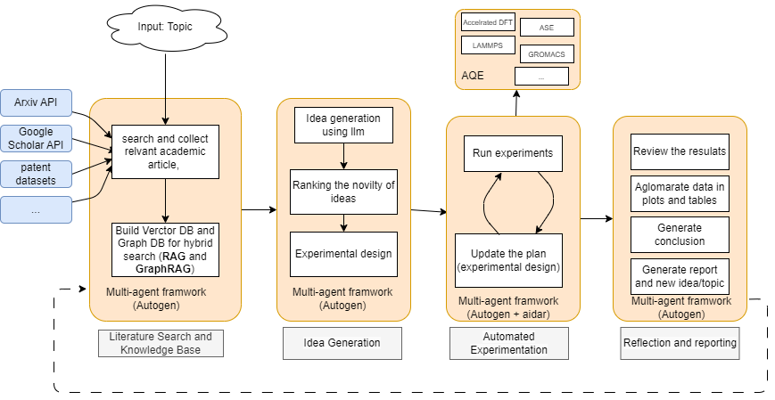

# AI Computational Material Scientist (AI ComMat Scientist)

### Project Scope:
The AI ComMat Scientist aims to create an automated system for computational materials science research, inspired by recent work on AI-driven scientific discovery. This project will leverage large language models (LLMs) and automated experimentation to accelerate the discovery and characterization of novel materials, with a focus on polymer science.

### Key Components:
1. Literature Search and Knowledge Base: Utilize APIs (e.g. Arxiv, Google Scholar) to gather relevant academic articles and build a vector/graph database for hybrid search.

2. Idea Generation: Employ LLMs to generate novel research ideas and experimental designs in computational materials science.

3. Automated Experimentation: Integrate with Azure Quantum Elements (AQE) to run computational experiments, including:
   - Electronic structure calculations
   - Molecular dynamics simulations  
   - Density functional theory (DFT) modeling
   - QM/MM simulations

4. Results Analysis: Automatically analyze experimental results, generate plots/tables, and draw conclusions.

5. Report Generation: Produce research reports and propose new ideas/topics for further investigation.

### Why AQE is Essential:
AQE provides critical capabilities for this project:
- Access to state-of-the-art computational chemistry packages (e.g. Q-Chem, LAMMPS, GROMACS) for polymer simulations
- Scalable cloud infrastructure for running intensive molecular dynamics simulations
- Integration with quantum computing resources for certain electronic structure calculations
- Tools for workflow automation and experiment tracking

The AI ComMat Scientist will leverage these AQE features to autonomously design and execute computational experiments on polymer degradability, accelerating the discovery of more environmentally friendly materials. By combining LLMs for idea generation with AQE's computational power, this project aims to demonstrate a new paradigm for AI-driven scientific research in materials science.

### Expected Outcome:
A proof-of-concept system that can autonomously propose, execute, and analyze computational experiments in polymer science, showcasing the potential for AI to accelerate scientific discovery in this domain. The system will demonstrate its capabilities by generating novel insights into polymer degradability and proposing new, potentially more degradable polymer structures for experimental validation.

### Example Research Topic: Polymer Degradability Prediction

The AI ComMat Scientist could investigate the degradability of biodegradable polymers using a combination of simulated and experimental data. Specifically:

1. Data Collection: Gather existing experimental data on polymer degradation rates and mechanisms for various biodegradable polymers.

2. Molecular Representation: Use AQE to perform molecular dynamics simulations of polymer chains, capturing their structural and dynamic properties.

3. Machine Learning Model: Develop a graph neural network (GNN) model that takes the molecular representation as input and predicts degradation rates and pathways.

4. Experimental Validation: Propose new polymer structures with predicted high degradability for experimental synthesis and testing.

5. Iterative Improvement: Use experimental results to refine the model and guide further computational investigations.

### Links:

- [The AI Scientist: Towards Fully Automated Open-Ended Scientific Discovery](https://arxiv.org/pdf/2408.06292)

- [Chaining thoughts and LLMs to learn DNA structural biophysics](https://arxiv.org/pdf/2403.01332)

- [The AI Scientist: Towards Fully Automated Open-Ended Scientific Discovery](https://sakana.ai/ai-scientist/)