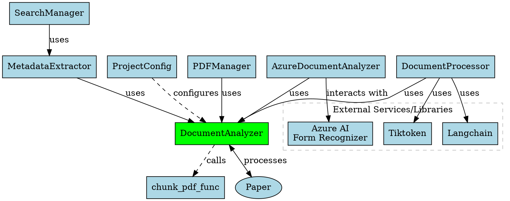

```graphviz
digraph DocumentAnalyzerSystem {
    rankdir=TB;
    node [shape=box, style=filled, fillcolor=lightblue];
    
    DocumentAnalyzer [fillcolor=green];
    
    AzureDocumentAnalyzer -> DocumentAnalyzer [label="uses"];
    DocumentProcessor -> DocumentAnalyzer [label="uses"];
    PDFManager -> DocumentAnalyzer [label="uses"];
    MetadataExtractor -> DocumentAnalyzer [label="uses"];
    
    SearchManager -> MetadataExtractor [label="uses"];
    
    DocumentAnalyzer -> "chunk_pdf_func" [label="calls", style=dashed];
    
    subgraph cluster_external {
        label = "External Services/Libraries";
        style = dashed;
        color = gray;
        
        AzureAI [label="Azure AI\nForm Recognizer"];
        Tiktoken [label="Tiktoken"];
        Langchain [label="Langchain"];
    }
    
    AzureDocumentAnalyzer -> AzureAI [label="interacts with"];
    DocumentProcessor -> Tiktoken [label="uses"];
    DocumentProcessor -> Langchain [label="uses"];
    
    ProjectConfig -> DocumentAnalyzer [label="configures", style=dashed];
    Paper [shape=ellipse];
    DocumentAnalyzer -> Paper [label="processes", dir=both];
}
```