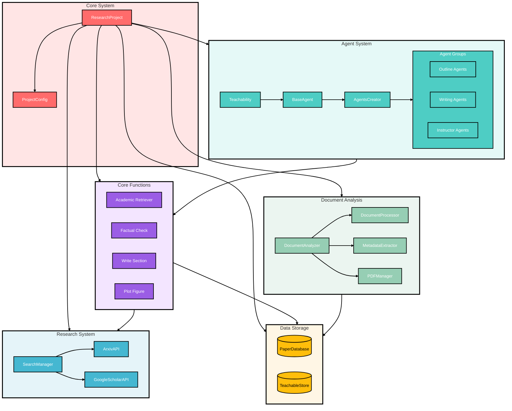

```mermaid
graph TD
    %% Node definitions with larger font
    subgraph Core["Core System"]
        RP["ResearchProject"]:::coreNode
        PC["ProjectConfig"]:::coreNode
        RP --> PC
    end

    subgraph Agents["Agent System"]
        BA["BaseAgent"]:::agentNode
        AC["AgentsCreator"]:::agentNode
        TC["Teachability"]:::agentNode
        AG["Agent Groups"]:::agentNode
        BA --> AC
        TC --> BA
        AC --> AG
        
        subgraph AG["Agent Groups"]
            direction LR
            OA["Outline Agents"]:::agentNode
            WA["Writing Agents"]:::agentNode
            IA["Instructor Agents"]:::agentNode
        end
    end

    subgraph Research["Research System"]
        SM["SearchManager"]:::researchNode
        ARXIV["ArxivAPI"]:::researchNode
        GS["GoogleScholarAPI"]:::researchNode
        SM --> ARXIV
        SM --> GS
    end

    subgraph Analysis["Document Analysis"]
        DA["DocumentAnalyzer"]:::analysisNode
        DP["DocumentProcessor"]:::analysisNode
        ME["MetadataExtractor"]:::analysisNode
        PM["PDFManager"]:::analysisNode
        DA --> DP
        DA --> ME
        DA --> PM
    end

    subgraph Storage["Data Storage"]
        DB[("PaperDatabase")]:::storageNode
        TS[("TeachableStore")]:::storageNode
    end

    subgraph Functions["Core Functions"]
        FR["Academic Retriever"]:::functionNode
        FC["Factual Check"]:::functionNode
        WS["Write Section"]:::functionNode
        PF["Plot Figure"]:::functionNode
    end

    %% Main connections with thicker lines
    RP ==> Agents
    RP ==> Research
    RP ==> Analysis
    RP ==> Storage
    RP ==> Functions

    %% Cross-component connections with thicker lines
    Functions ==> Research
    Functions ==> Storage
    Agents ==> Functions
    Analysis ==> Storage

    %% Custom styles for different components
    classDef coreNode fill:#FF6B6B,stroke:#000000,stroke-width:2px,color:white,font-size:14px
    classDef agentNode fill:#4ECDC4,stroke:#000000,stroke-width:2px,color:white,font-size:14px
    classDef researchNode fill:#45B7D1,stroke:#000000,stroke-width:2px,color:white,font-size:14px
    classDef analysisNode fill:#96CEB4,stroke:#000000,stroke-width:2px,color:white,font-size:14px
    classDef storageNode fill:#FFBE0B,stroke:#000000,stroke-width:2px,color:black,font-size:14px
    classDef functionNode fill:#9B5DE5,stroke:#000000,stroke-width:2px,color:white,font-size:14px

    %% Subgraph styling
    style Core fill:#FFE5E5,stroke:#000000,stroke-width:3px
    style Agents fill:#E5F9F7,stroke:#000000,stroke-width:3px
    style Research fill:#E5F4F9,stroke:#000000,stroke-width:3px
    style Analysis fill:#EBF5F0,stroke:#000000,stroke-width:3px
    style Storage fill:#FFF6E5,stroke:#000000,stroke-width:3px
    style Functions fill:#F3E5FF,stroke:#000000,stroke-width:3px

    linkStyle default stroke:#000000,stroke-width:2px
```