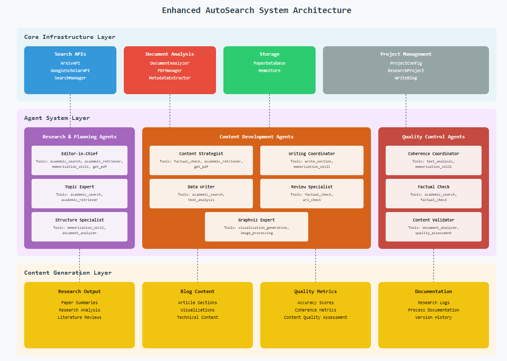

# Autosearch: Multi-Agent Academic Research and Content Generation System

## Project Overview

Autosearch is a sophisticated multi-agent system designed to automate and enhance academic research and content generation processes. The project leverages advanced AI capabilities in [autogen](https://github.com/microsoft/autogen) to create a collaborative environment where specialized agents work together to research, analyze, and produce high-quality academic content.

## high-level architecture diagram




### Components and Interactions**:

**Core Infrastructure Layer (Blue Background)**:

- Search APIs (Blue)
- Document Analysis (Red)
- Storage Systems (Green)
- Project Management (Gray)


**Agent System Layer (Purple Background)**:

- Research & Planning Agents (Purple)

    - Editor-in-Chief with comprehensive tools
    - Topic Expert with research tools
    - Structure Specialist with analysis tools


- Content Development Agents (Orange)

    - Content Strategist with fact-checking tools
    - Writing Coordinator with section management
    - Data Writer with research tools
    - Review Specialist

## Core Components

### 1. Agent System
- **Base Architecture** (`agents/`)
  - Implements a flexible multi-agent framework using the `BaseAgent` class
  - Features a teachable agent system with memory capabilities (`teachability.py`)
  - Includes an agent creation factory (`agents_creator.py`) for dynamic agent instantiation

### 2. Research Capabilities
- **API Integration** (`api/`)
  - Implements ArxivAPI and GoogleScholarAPI for academic paper retrieval
  - Features a unified SearchManager for coordinated searches across multiple sources
  - Includes base classes for easy extension to additional academic sources

### 3. Document Analysis
- **Analysis Tools** (`analysis/`)
  - Azure-powered document analysis system for PDF processing
  - Metadata extraction capabilities for academic papers
  - Table and figure extraction utilities
  - PDF management system for handling local and remote documents

### 4. Content Generation
- **Collaborative Writing** (`chat/`, `communities/`)
  - Outline creation system for structured content development
  - Instruction generation for content guidelines
  - Section-based writing system with specialized agents
  - Quality control and coherence checking mechanisms

### 5. Data Management
- **Storage and Retrieval** (`database/`, `data/`)
  - SQL-based paper database for efficient storage and retrieval
  - Paper metadata management system
  - Structured data models for academic content

### 6. Core Functions
- **Research Tools** (`functions/`)
  - Academic paper retrieval and processing
  - Factual checking and verification
  - PDF processing and analysis
  - Text analysis and memory systems
  - URL validation and checking

## Key Features

1. **Intelligent Research**
   - Automated paper discovery and retrieval
   - Multi-source search capabilities
   - Smart filtering and relevance checking

2. **Advanced Content Generation**
   - Structured content development
   - Multi-agent collaborative writing
   - Quality control and fact-checking

3. **Memory and Learning**
   - Teachable agents with memory retention
   - Experience-based learning capabilities
   - Knowledge base building and management

4. **Quality Assurance**
   - Automated fact-checking
   - Content coherence verification
   - Citation management and validation

5. **Visualization Support**
   - Graphviz-based diagram generation
   - Figure and table extraction
   - Visual content management

## Technical Architecture

The project follows a modular architecture with clear separation of concerns:

- **Core Framework** (`project_config.py`, `research_project.py`)
  - Project configuration management
  - Research workflow orchestration
  - System integration and coordination

- **Agent Communities** (`communities/`)
  - Specialized agent groups for different tasks
  - Role-based agent configurations
  - Inter-agent communication protocols

- **Analysis Pipeline** (`analysis/`)
  - Document processing workflows
  - Content extraction systems
  - Metadata management

## Development and Testing

The project includes comprehensive testing capabilities:
- Jupyter notebooks for component testing
- Unit tests for core functionalities
- Integration testing frameworks

## Use Cases

1. **Academic Research**
   - Literature review automation
   - Paper analysis and summarization
   - Research trend identification

2. **Content Creation**
   - Blog post generation
   - Technical document writing
   - Research paper drafting

3. **Knowledge Management**
   - Paper database management
   - Research knowledge base building
   - Citation management

## Future Development

The project's modular structure allows for:
- Integration of additional academic sources
- Enhancement of agent capabilities
- Extension of content generation features
- Implementation of new analysis tools
- Development of user interfaces

## Technical Requirements

- Python 3.11+
- Dependencies:
  - autogen
  - arxiv
  - Azure AI Form Recognizer
  - PyPDF2
  - langchain
  - Various other libraries specified in setup.py

## Getting Started

1. Install required dependencies:
   ```bash
   pip install -e .
   ```

2. Configure API keys:
   - Set up Azure Document Intelligence credentials
   - Configure academic API access

3. Initialize the project:
   ```python
   from autosearch.research_project import ResearchProject
   project = ResearchProject(...)
   ```

The project is designed to be both powerful and extensible, allowing researchers and developers to automate and enhance their academic research and content generation workflows while maintaining high standards of quality and accuracy.


## Detailed Explanation of Autosearch Usage Example

### 1. Project Initialization

```python
title = "Exploring the Intricacies of Polymer Representation: Unraveling Complexity"
test_project = ResearchProject(
    project_id = "project_test",
    version= "0.2",
    config=config,
    config_file="OAI_CONFIG_LIST-sweden-505",
    initiate_db= False,
    funcClsList = ["FactualCheck", "GetPDF", "GetPDFs", "UrlCheck", 
                  "AcademicRetriever", "AcademicSearch", "WriteSection", "PlotFigure"],
    communiteList = ["outline_agents", "write_section_agents", "instructor_agents"],
    local_papers_dir="./papers",
    models = ["gpt-35-turbo", "gpt-35-turbo-16k"]
)
```

#### Parameters Explained:

1. **Basic Project Settings**:
   - `project_id`: "project_test" - Unique identifier for the project
   - `version`: "0.2" - Version tracking for the project
   - `config`: Configuration dictionary containing API keys and other settings
   - `config_file`: Path to the OpenAI API configuration file

2. **Database Configuration**:
   - `initiate_db`: False - Indicates whether to initialize a new database
   - `local_papers_dir`: "./papers" - Directory for local PDF papers

3. **Function List** (`funcClsList`):
   - `FactualCheck`: Verifies accuracy of content
   - `GetPDF`, `GetPDFs`: Retrieves PDF documents
   - `UrlCheck`: Validates academic URLs
   - `AcademicRetriever`, `AcademicSearch`: Searches academic databases
   - `WriteSection`: Handles section writing
   - `PlotFigure`: Creates visualizations

4. **Agent Communities** (`communiteList`):
   - `outline_agents`: Creates document structure
   - `write_section_agents`: Writes individual sections
   - `instructor_agents`: Provides writing instructions

5. **Models**:
   - Uses GPT-3.5 Turbo models (standard and 16k context)

### 2. Project Configuration

```python
project_config = test_project.ProjectConfig
print(project_config.logging_session_id)
```

- Creates a project configuration object
- Generates a unique logging session ID for tracking
- Contains essential project settings and paths

### 3. Project Execution

```python
test_project.run(
    title=title,
    target_audience="expert in experimental polymer science and machine learning experts"
)
```

#### Execution Process:

1. **Initialization Phase**:
   - Sets up project directory structure
   - Initializes database connections
   - Prepares agent communities

2. **Research Phase**:
   - Searches academic databases for polymer representation papers
   - Downloads and processes relevant PDFs
   - Extracts key information and metadata

3. **Content Planning Phase**:
   - `instructor_agents` create detailed writing instructions
   - `outline_agents` develop structured outline
   - Creates mind maps and section breakdowns

4. **Writing Phase**:
   - `write_section_agents` generate content for each section
   - Incorporates research findings and citations
   - Creates visualizations and diagrams

5. **Review Phase**:
   - Fact-checks content against sources
   - Ensures coherence between sections
   - Validates technical accuracy

### Project Output

The final output includes:

1. **Complete Blog Post**:
   - Comprehensive coverage of polymer representation
   - Technical content suitable for expert audience
   - Properly cited academic sources

2. **Supporting Materials**:
   - Mind maps and visualizations
   - Section outlines and structures
   - Reference lists and citations

3. **Project Documentation**:
   - Logging information
   - Process tracking
   - Generated artifacts

### Directory Structure

The project creates the following structure:
```
project_test/
├── 0.2/
│   ├── db/           # Database files
│   ├── output/       # Generated content
│   ├── results/      # Final outputs
│   ├── logs.db       # Process logs
│   └── papers.db     # Paper database
```

## Target Audience Considerations

The specified target audience ("expert in experimental polymer science and machine learning experts") influences:
- Technical depth of content
- Terminology usage
- Complexity of explanations
- Type of examples and applications discussed
- Level of mathematical and theoretical detail

## file structure of project

```
autosearch/
├── setup.py
└── notebooks/
    ├── test_ArxivAPI.ipynb
    ├── test_DocumentAnalyzer.ipynb
    ├── test_PaperDatabase.ipynb
    ├── 
    ├── 
    └── 
└── src/
    └── autosearch/
        ├── __init__.py
        ├── agents/
        │   ├──outlinecreator_agents/
        │      ├── __init__.py
        │      ├── editor_agent.py
        │      ├── critic_agent.py
        │   ├── __init__.py
        │   ├── base_agent.py
        │   ├── teachable_agent.py
        │   ├── writer_agent.py
        │   └── reviewer_agent.py
        ├── api/
        │   ├── __init__.py
        │   └── arxiv_api.py
        │
        ├── analysis/
        │   ├── __init__.py
        │   └── document_analyzer.py
        │
        ├── database/
        │   ├── __init__.py
        │   └── paper_database.py
        │
        ├── chat/
        │   ├── __init__.py
        │   ├── group_chat.py
        │   ├── outline_creator.py
        │   ├── section_writer.py
        │   └── blog_compiler.py
        └── research_project.py

```